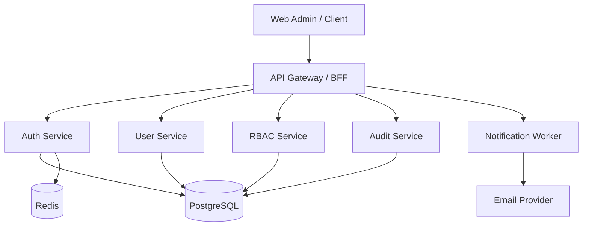

# 用户管理系统设计文档

## 1. Overview
本文档基于 `REQ-01 ~ REQ-09` 设计用户管理系统的技术方案，确保需求、实现与测试可追踪。

设计目标：
- 安全优先：认证、鉴权、审计可落地。
- 模块清晰：用户域、认证域、权限域、审计域解耦。
- 易演进：预留多租户、MFA、SSO 扩展点。

## 2. 架构设计

### 2.1 逻辑架构


### 2.2 组件职责
- `Auth Service`
  - 处理注册、激活、登录、令牌刷新、登出、密码重置、MFA 校验。
- `User Service`
  - 管理用户资料、用户状态、管理员用户 CRUD。
- `RBAC Service`
  - 管理角色、权限点、用户-角色映射与鉴权决策。
- `Audit Service`
  - 写入并查询审计日志。
- `Notification Worker`
  - 异步发送邮件通知，失败重试。

### 2.3 关键决策
1. 决策：鉴权采用 `JWT Access Token + Refresh Token Rotation`
   - 原因：兼顾无状态访问性能与会话可撤销能力（通过 refresh 黑名单/版本号）。
2. 决策：权限模型采用 `RBAC`
   - 原因：满足当前复杂度，便于后台管理；后续可扩展 ABAC。
3. 决策：审计日志单独表并强制写入关键事件
   - 原因：满足合规与问题追溯，避免与业务日志混杂。
4. 决策：通知异步化（队列/任务）
   - 原因：不阻塞主链路，提升接口稳定性。

## 3. 组件与接口设计

## 3.1 Auth API
- `POST /api/v1/auth/register`（REQ-01）
- `POST /api/v1/auth/activate`（REQ-01）
- `POST /api/v1/auth/login`（REQ-02）
- `POST /api/v1/auth/refresh`（REQ-02）
- `POST /api/v1/auth/logout`（REQ-02）
- `POST /api/v1/auth/password/forgot`（REQ-06）
- `POST /api/v1/auth/password/reset`（REQ-06）
- `POST /api/v1/auth/mfa/verify`（REQ-06）

请求/响应约定：
- 全部 JSON。
- 统一错误结构：
```json
{
  "code": "AUTH_INVALID_CREDENTIALS",
  "message": "Invalid email or password",
  "request_id": "req_123",
  "details": {}
}
```

## 3.2 User API
- `GET /api/v1/users/me`（REQ-03）
- `PATCH /api/v1/users/me`（REQ-03）
- `GET /api/v1/admin/users`（REQ-04）
- `POST /api/v1/admin/users`（REQ-04）
- `PATCH /api/v1/admin/users/{user_id}`（REQ-04）
- `POST /api/v1/admin/users/{user_id}/disable`（REQ-04）
- `POST /api/v1/admin/users/{user_id}/enable`（REQ-04）
- `POST /api/v1/admin/users/{user_id}/reset-password`（REQ-04）

## 3.3 RBAC API
- `GET /api/v1/admin/roles`（REQ-05）
- `POST /api/v1/admin/roles`（REQ-05）
- `PATCH /api/v1/admin/roles/{role_id}`（REQ-05）
- `DELETE /api/v1/admin/roles/{role_id}`（REQ-05）
- `POST /api/v1/admin/users/{user_id}/roles`（REQ-05）
- `DELETE /api/v1/admin/users/{user_id}/roles/{role_id}`（REQ-05）

## 3.4 Audit API
- `GET /api/v1/admin/audit-logs`（REQ-07）
  - 过滤参数：`operator_id`, `target_user_id`, `event_type`, `from`, `to`, `page`, `size`

## 4. 数据模型

## 4.1 users
| 字段 | 类型 | 约束 | 说明 |
|---|---|---|---|
| id | uuid | PK | 用户ID |
| email | varchar(255) | unique, not null | 登录邮箱 |
| password_hash | varchar(255) | not null | 密码哈希 |
| status | varchar(32) | not null | active/disabled/pending |
| display_name | varchar(100) | nullable | 昵称 |
| phone | varchar(30) | nullable | 手机号 |
| email_verified | boolean | default false | 邮箱已验证 |
| mfa_enabled | boolean | default false | 是否启用MFA |
| failed_login_count | int | default 0 | 连续失败次数 |
| locked_until | timestamp | nullable | 锁定截止时间 |
| token_version | int | default 1 | 令牌版本（会话失效控制） |
| created_at | timestamp | not null | 创建时间 |
| updated_at | timestamp | not null | 更新时间 |

索引：
- `idx_users_email`
- `idx_users_status`

## 4.2 roles
| 字段 | 类型 | 约束 | 说明 |
|---|---|---|---|
| id | uuid | PK | 角色ID |
| name | varchar(64) | unique, not null | 角色名 |
| description | varchar(255) | nullable | 描述 |
| created_at | timestamp | not null | 创建时间 |
| updated_at | timestamp | not null | 更新时间 |

## 4.3 permissions
| 字段 | 类型 | 约束 | 说明 |
|---|---|---|---|
| id | uuid | PK | 权限ID |
| code | varchar(128) | unique, not null | 权限编码 |
| description | varchar(255) | nullable | 描述 |

## 4.4 role_permissions
| 字段 | 类型 | 约束 | 说明 |
|---|---|---|---|
| role_id | uuid | PK/FK | 角色ID |
| permission_id | uuid | PK/FK | 权限ID |

## 4.5 user_roles
| 字段 | 类型 | 约束 | 说明 |
|---|---|---|---|
| user_id | uuid | PK/FK | 用户ID |
| role_id | uuid | PK/FK | 角色ID |
| assigned_at | timestamp | not null | 分配时间 |

## 4.6 sessions_refresh_tokens
| 字段 | 类型 | 约束 | 说明 |
|---|---|---|---|
| id | uuid | PK | 会话ID |
| user_id | uuid | FK | 用户ID |
| refresh_token_hash | varchar(255) | unique | 刷新令牌哈希 |
| expires_at | timestamp | not null | 过期时间 |
| revoked_at | timestamp | nullable | 撤销时间 |
| device_info | varchar(255) | nullable | 设备信息 |
| ip | varchar(45) | nullable | 来源IP |

## 4.7 audit_logs
| 字段 | 类型 | 约束 | 说明 |
|---|---|---|---|
| id | uuid | PK | 日志ID |
| operator_id | uuid | nullable | 操作者 |
| target_user_id | uuid | nullable | 目标用户 |
| event_type | varchar(64) | not null | 事件类型 |
| action | varchar(64) | not null | 操作 |
| result | varchar(16) | not null | success/fail |
| ip | varchar(45) | nullable | 来源IP |
| user_agent | varchar(255) | nullable | UA |
| metadata | jsonb | nullable | 扩展信息 |
| created_at | timestamp | not null | 事件时间 |

索引：
- `idx_audit_logs_created_at`
- `idx_audit_logs_event_type`
- `idx_audit_logs_operator_id`

## 5. 核心流程

### 5.1 登录流程（REQ-02/REQ-06）
1. 校验账号状态（pending/disabled/locked）。
2. 校验密码哈希。
3. 失败则增加失败计数，达到阈值触发锁定并写入审计。
4. 成功则清空失败计数，若启用 MFA 进入二步验证。
5. 签发 access token 与 refresh token，刷新令牌入库（哈希存储）。

### 5.2 管理员禁用用户（REQ-04）
1. 校验操作人权限 `user:disable`。
2. 更新 `users.status=disabled`。
3. 增加 `token_version` 或撤销活跃 refresh token，确保会话快速失效。
4. 写入审计日志并触发通知。

## 6. 安全设计
- 密码：`Argon2id` 或 `bcrypt(cost>=12)`。
- 令牌：
  - Access Token 短时有效（如 15 分钟）。
  - Refresh Token 长时有效（如 7-30 天），轮换并可撤销。
- 防护：
  - 登录接口限流（IP + 账号维度）。
  - CSRF 防护（若采用 Cookie 模式）。
  - 输入校验、输出最小化、敏感字段脱敏。
- 审计：
  - 关键安全事件强制审计，日志不可被普通管理员篡改。

## 7. 错误处理策略
| 类别 | HTTP | 业务码示例 | 处理策略 |
|---|---|---|---|
| 参数校验错误 | 400 | VALIDATION_ERROR | 返回字段级错误 |
| 未认证 | 401 | AUTH_UNAUTHORIZED | 引导重新登录 |
| 无权限 | 403 | AUTH_FORBIDDEN | 记录越权尝试 |
| 资源不存在 | 404 | USER_NOT_FOUND | 返回统一错误 |
| 冲突 | 409 | EMAIL_ALREADY_EXISTS | 幂等提示 |
| 频率限制 | 429 | RATE_LIMITED | 返回重试建议 |
| 服务异常 | 500 | INTERNAL_ERROR | 记录 request_id 与告警 |

## 8. 可观测性与运维
- 日志：结构化 JSON，包含 `request_id`、`user_id`、耗时、状态码。
- 指标：
  - 登录成功率、登录失败率、账号锁定次数。
  - 关键接口 P95/P99。
  - 通知发送成功率与重试次数。
- 健康检查：
  - `/health/live`（进程活性）
  - `/health/ready`（数据库/缓存可用性）

## 9. 测试策略
- 单元测试：
  - 密码策略、令牌策略、权限决策、状态迁移。
- 集成测试：
  - 认证 API、管理 API、RBAC、审计写入与查询。
- 端到端测试：
  - 注册激活 -> 登录 -> 修改资料 -> 管理员禁用 -> 用户登录失败。
- 安全测试：
  - 暴力破解限流、令牌重放、越权访问、输入注入。

## 10. 需求追踪矩阵
| 需求 | 设计落点 |
|---|---|
| REQ-01 | Auth API(register/activate), users 表 |
| REQ-02 | Auth API(login/refresh/logout), refresh token 表 |
| REQ-03 | User API(me), users 表字段约束 |
| REQ-04 | Admin User API, token 失效策略 |
| REQ-05 | RBAC API, roles/permissions/user_roles |
| REQ-06 | 密码策略、锁定策略、MFA 流程 |
| REQ-07 | audit_logs 模型 + Audit API |
| REQ-08 | Notification Worker + 重试机制 |
| REQ-09 | 结构化日志、指标、健康检查 |
